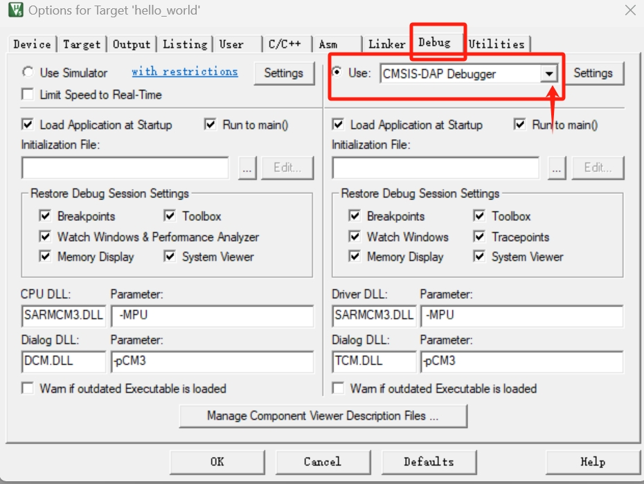
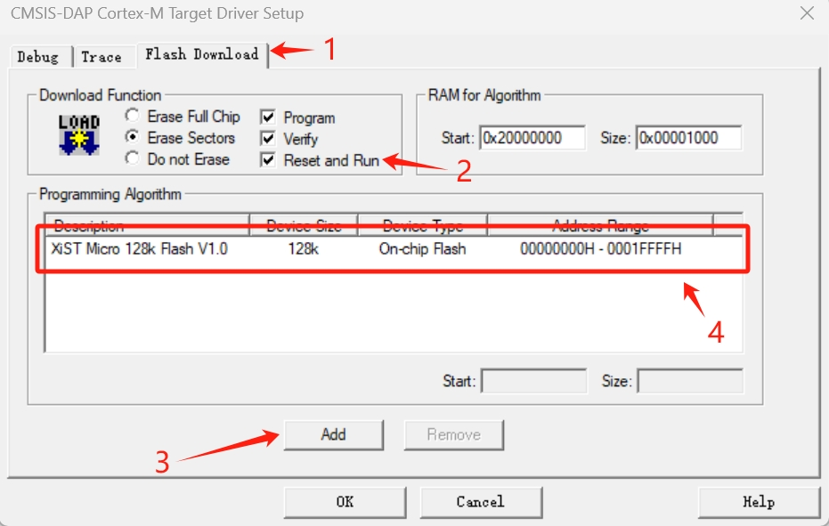

# Keil 配置

## 调试器选择

- SA5Z-30/SA5Z-50系列 SOC 内部集成了 Cortex-M3/Cortex-M33 硬核，该 CPU 可使用常见调试器进行调试。
- 在 Keil 中较为推荐使用 DAPlink 使用 SWD 模式对芯片调试，调试器价格较低，连接线少。

## 硬件连接

- 使用 HQFPGA 工具对 FPGA 中的硬核 CPU 例化，选择调试接口为 SWD 模式。
- 对硬件进行连接 SWDIO/SWCLK 两根线分别连接到 FPGA 中配置的 IO 上。

## 配置调整

- 软件中 system_CM3DS.c 中的 CLK_TREE 需要根据 FPGA 提供的系统主频调整。

## 编译烧录

- 将 ../tools/SA30K_EFlash.FLM 文件复制到 Keil 安装目录的 ./ARM/Flash 内。
- 右键工程主目录，选择 **Options** 配置界面，选择调试工具选择框，选择 **CMSIS-DAP Debugger**

- 选择 **CMSIS-DAP Debugger** 后的 **Settings** 进入 调试器配置界面
- 根据自己需求配置好调试器 **Debug** 页面基本参数，点击 **Flash Download**
- 
- **添加 SA30K_EFlash.FLM 提示** 该文件位置在 S 开头的字母序列，名称为 XiST Micro 128k Flash V1.0
