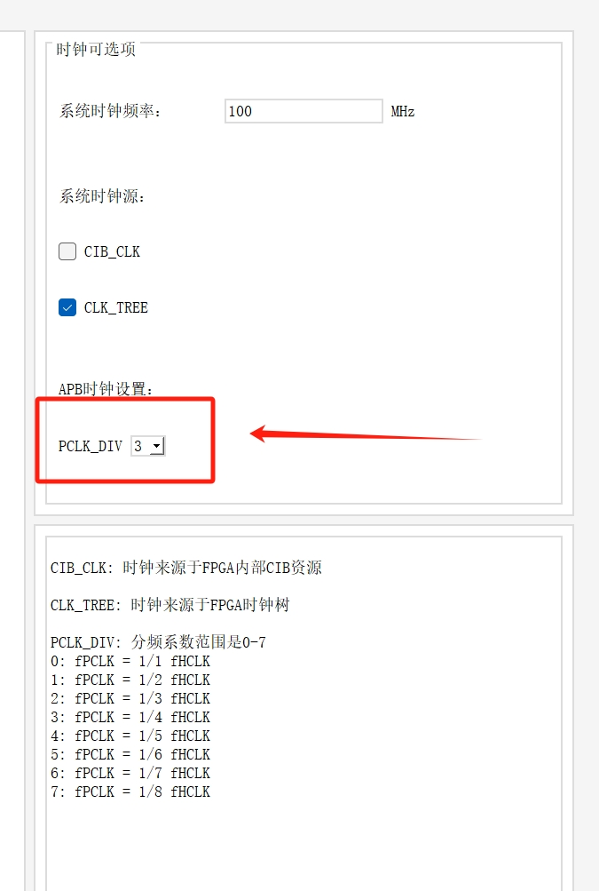

# FPGA 配置

## 安装开发软件

- 下载开发软件 [hqfpga_xist](http://211.157.136.83/hqfpga_xist/under_development/), 解压并运行。build\win_x64\hqui\hqui.exe
- 创建工程，在 **IP管理** 中创建并生成 CM3 核。
- 配置 APB 总线的分频系数，目前在 125M/100M 主频的情况下推荐数值为 3。
- 
- 软件中 system_CM3DS.c 中的 CLK_TREE 需要根据 FPGA 提供的系统主频调整。